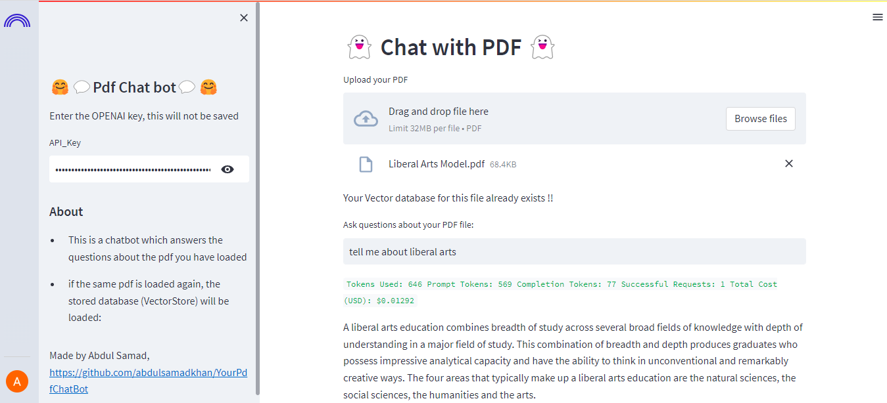
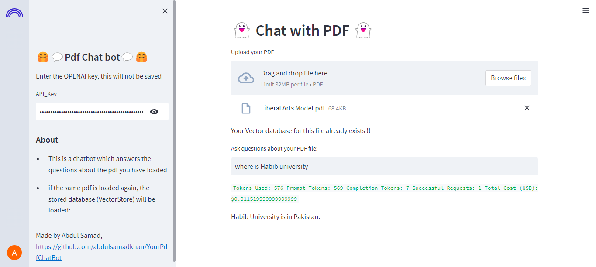

# YourPdfChatBot
This repository provides the necessary code to create your own PDF chatbot using OPENAI. With this implementation, you have full control over the chatbot's functionalities. Simply provide your own OPENAI_KEY, which is not stored, and upload your PDF files to ask any question you desire. It's worth noting that once you store a PDF, its embeddings are saved, eliminating the need for additional API calls and conserving your valuable OPENAI credits.
# demo
https://databutton.com/v/aqmnwlmr

# Use Case  
I apploaded the Liberal Arts Model.pdf for demonstration and asked two questions. The below image snippets shows the chatbot screen

